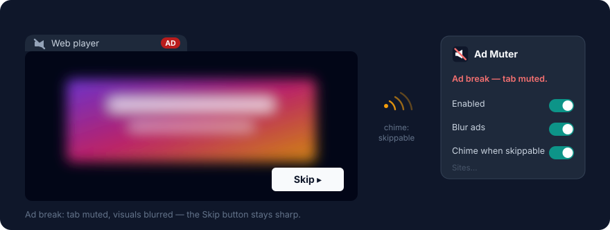
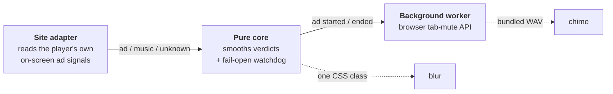

<h1 align="center"><br/>Ad Muter</h1>

<p align="center"><b>Ads still play. Your speakers sit them out.</b></p>

<p align="center">
  <a href="https://github.com/vviseguy/ad-muter/actions/workflows/ci.yml"></a>
  
  
  
</p>

<p align="center">
  <a href="https://github.com/vviseguy/ad-muter/releases/latest/download/ad-muter-chrome.zip"></a>
  &nbsp;&nbsp;
  <a href="https://github.com/vviseguy/ad-muter/releases/latest/download/ad-muter-firefox.zip"></a>
</p>

<p align="center">
  
</p>

A browser extension that **mutes the tab during ad breaks** on the Spotify
web player and YouTube — optionally blurring the player and chiming when an
ad becomes skippable — then restores everything when content returns.
Nothing is blocked, intercepted, modified, or sent anywhere.

## Trust, before features

Every claim below is a **CI failure** if it stops being true — not a
promise in a privacy policy:

| Claim | Enforced by |
|---|---|
| 🚫 **Zero network access** — no `fetch`, XHR, WebSocket, beacon, anywhere | [guard test](tests/guards.test.ts) scans every source file |
| 🔐 **Two permissions, total** — `storage`, plus `offscreen` on Chrome | guard pins the per-browser sets; a PR that grows them fails |
| 👁️ **Sees exactly two sites** — and can't gain more at runtime | manifest origins pinned to [one site list](src/shared/sites.ts) |
| 🖱️ **Never clicks the player** — no auto-skip, ever | project contract; no such code path exists ([why](#faq)) |
| 🔊 **Can't leave you stuck muted** — detection bugs fail *open* | watchdog in the [core state machine](src/core/detector.ts), [unit tested](tests/detector.test.ts) |
| 📦 **No binaries in the repo** — icons and chime are generated by code | [`scripts/gen-*.mjs`](scripts), with container tests |
| 📖 **Small enough to actually audit** | ~1,200 lines of TypeScript under [`src/`](src) |

## What it does

- 🔇 **Mutes the tab** the moment an ad break starts — using the browser's
  own tab-mute control, the same one on the tab strip. One click overrides it.
- 🔊 **Unmutes when content returns** — and never touches a mute *you* set.
- 🌫️ **Blurs the player** during the break (optional) — skip buttons and
  controls stay crisp and clickable.
- 🔔 **Chimes when an ad becomes skippable** (optional) — you look up, *you*
  click Skip.
- 🎚️ **Per-site switches** — right-click the icon → Options.



Muting is *listener-side*: the ad is delivered, played, and counted — your
speakers just don't participate. Same category as the venerable EZBlocker,
never the interception category that gets tools removed from stores.

## Install

**From a release** — download
[**ad-muter-chrome.zip**](https://github.com/vviseguy/ad-muter/releases/latest/download/ad-muter-chrome.zip)
or
[**ad-muter-firefox.zip**](https://github.com/vviseguy/ad-muter/releases/latest/download/ad-muter-firefox.zip)
(always the [latest release](https://github.com/vviseguy/ad-muter/releases)),
unzip it, then:

| Browser | How to load |
|---|---|
| Chrome / Edge / Brave / Opera / Vivaldi | `chrome://extensions` → Developer mode → **Load unpacked** → the unzipped folder |
| Firefox | `about:debugging#/runtime/this-firefox` → **Load Temporary Add-on…** → `manifest.json` |
| Safari | `xcrun safari-web-extension-converter <folder>` on macOS (untested) |

<details>
<summary><b>From source</b> (~30 seconds)</summary>

```
npm install
npm run package
```

Load `dist/chrome` or `dist/firefox` as above. The zips in `dist/` are
byte-reproducible: same source, identical archives — you can rebuild a
release and `diff` it.

</details>

## The details

<details>
<summary><b>Permissions, line by line</b></summary>

| Grant | Why |
|---|---|
| Content script on `https://open.spotify.com/*` and `https://www.youtube.com/*` | Read each player's on-screen state. The extension cannot see any other site. |
| `storage` | Remember the toggles, and track which tabs *we* muted so we never unmute one *you* muted. |
| `offscreen` (Chrome only) | Play the bundled skip chime. The ad tab is muted, so the sound comes from an offscreen extension page; this permission grants no data access and shows no install warning. Firefox plays the chime from its background page and doesn't need it. |

No `tabs`, no `<all_urls>`, no `webRequest`, no `declarativeNetRequest`, no
remote code. The extension never reads a tab URL — even per-site logic runs
off the message sender's origin.

</details>

<details>
<summary><b>How detection decides</b></summary>

Each site adapter reads its player's own ad signaling — Spotify's
now-playing bar and tab title, YouTube's `ad-showing` player class — and
reports **ad**, **music**, or **unknown**. A pure state machine smooths the
stream with asymmetric hysteresis: mute eagerly (one ad verdict), unmute
conservatively (two consecutive content verdicts). "Unknown" never changes
state — no guessing — and if signals go dark while muted, a watchdog fails
**open**: a detection bug may cost you a muted moment, never a permanently
muted tab.

All DOM assumptions live in one `selectors.ts` file per site
([spotify](src/sites/spotify/selectors.ts) ·
[youtube](src/sites/youtube/selectors.ts)); when a player redesign breaks
detection, that file is the fix, and
[docs/DETECTION.md](docs/DETECTION.md) has 2-minute verification recipes.

</details>

<details>
<summary id="faq"><b>FAQ</b> — is this an ad blocker? why no auto-skip? can Spotify tell?</summary>

**Is this an ad blocker?**
No. Nothing is blocked. The ad plays, is delivered, and is counted; your
speakers just don't participate.

**Why not block the ads outright?**
Blocking requires intercepting the player's network traffic or modifying
its code — both fragile, both against the services' Terms, and both the
reason other tools in this space have been removed from stores or gotten
accounts banned. Muting touches nothing that belongs to the service.

**Why chime instead of auto-skipping?**
Because the click is the line. Everything this extension does is on the
listener's side of the glass: what reaches your ears and eyes. The moment
it presses a player's controls for you, it becomes an agent interacting
with the ad system itself — synthesizing engagement signals and altering
what advertisers are billed for. The chime keeps the human as the actor:
you hear it, you decide, one click.

**Can Spotify or YouTube tell I'm using it?**
The extension changes nothing the page can observe through its own
delivery: it doesn't touch the page's audio elements, network, or code.
Tab mute happens at the browser level, outside the page. (A page can still
infer output muting through browser APIs if it goes looking; no tool can
promise invisibility — the honest version is in
[docs/PRIVACY.md](docs/PRIVACY.md).)

**Can I turn it off for just one site? / add my own sites?**
Per-site switches: right-click the icon → Options. Adding a *new* site
takes a code change and a new version — the extension cannot gain site
access at runtime, by design.

**Does it collect anything?**
It cannot. There is no code path to the network — enforced by tests, in a
repo you can read in one sitting.

</details>

<details>
<summary><b>Development &amp; releasing</b></summary>

```
npm run ci        # typecheck + tests + build — what CI runs
npm test          # unit + guard tests
npm run package   # build + deterministic zips into dist/
```

The version lives in `package.json` alone; builds stamp it into each
manifest. Releasing is:

```
npm version minor && git push --follow-tags
```

The tag triggers [release.yml](.github/workflows/release.yml): full CI,
then a GitHub Release with both zips attached.

Ground rules for PRs are in [CONTRIBUTING.md](CONTRIBUTING.md) — the short
version: no new permissions, no network, core stays pure, and the extension
never clicks the page.

</details>

## Go deeper

| Doc | What's in it |
|---|---|
| [ARCHITECTURE.md](docs/ARCHITECTURE.md) | The three layers, mute etiquette, failure modes and what each costs |
| [DETECTION.md](docs/DETECTION.md) | Per-site signals, smoothing, live verification recipes |
| [PRIVACY.md](docs/PRIVACY.md) | The whole policy, and how CI enforces it |
| [CONTRIBUTING.md](CONTRIBUTING.md) | Ground rules and setup |

---

<sub>Spotify is a trademark of Spotify AB; YouTube is a trademark of Google
LLC. This project is not affiliated with, endorsed by, or sponsored by
either. The names are used only to describe, factually, which websites the
extension operates on. Dual-licensed under [MIT](LICENSE-MIT) or
[Apache-2.0](LICENSE-APACHE), at your option.</sub>
